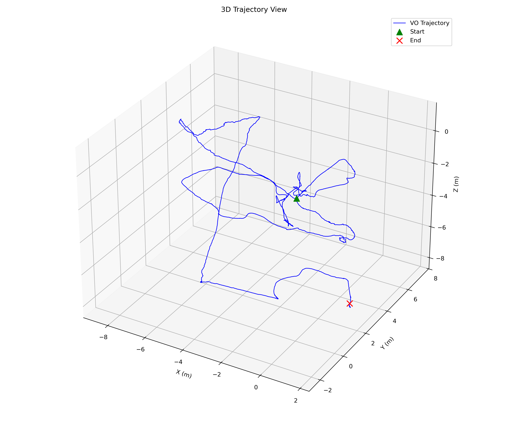

# Deep Learning Enhanced Stereo Visual Odometry (DL-VO)

A robust Stereo Visual Odometry pipeline implemented in **ROS2** that leverages deep learning for feature extraction and matching. By replacing traditional hand-crafted features (ORB/SIFT) with **SuperPoint** and **SuperGlue**, this system achieves stable tracking in challenging, low-texture environments (such as the EuRoC Machine Hall) where classical methods often fail.


*Reconstructed 3D trajectory on EuRoC V1_01 compared to Ground Truth (Green: Start, Red: End)*

## Features

* **Deep Front-End:** Utilizes [SuperPoint](https://github.com/magicleap/SuperPointPretrainedNetwork) for keypoint detection and [SuperGlue](https://github.com/magicleap/SuperGluePretrainedNetwork) for robust graph-based matching.
* **Geometric Back-End:** Implements Frame-to-Frame tracking using Iterative PnP with RANSAC.
* **Factor Graph Optimization:** Uses **GTSAM** to smooth relative pose estimates and reduce high-frequency jitter.
* **Robust Outlier Rejection:**
    * Strict stereo rectification and epipolar constraints.
    * Dynamic depth filtering to balance scene coverage vs. scale drift.
    * Velocity clamping to reject physically impossible jumps.

## Dependencies

* **ROS2**
* **Python 3.8+**
* **PyTorch** 
* **OpenCV** (`opencv-python` and `cv_bridge`)
* **GTSAM** Python bindings (`pip install gtsam`)
* **SciPy** & **Pandas** (for logging and visualization)

## Usage

### 1. Download Data
Download the `rosbag2`, ground truth, and config data for **Vicon Room 1 01** (V1_01_easy) from the [OpenVINS Datasets page](https://docs.openvins.com/gs-datasets.html).

For other datasets, edit `dl_vo.py` (or a launch file) to tune runtime parameters:
* `max_keypoints`: 2048 (Recommended)
* `max_depth`: 7.0m (Tuned for indoor environments)
* `QUEUE_SIZE`: 2900 (To buffer all frames if processing offline)
* `MAX_VELOCITY`: 0.1m/frame (Approx. 2x the max ground truth velocity)

### 2. Run the Node
Start the docker container.

In another terminal, run:
```bash
python3 controller.py
```
Results are saved in output.csv & dl_vo_log.txt.

To replicate the evaluation plots (Trajectory and Relative Motion), run the visualization scripts locally:
```bash
python3 visualize_dlvo.py
python3 visualize_ground_truth.py
```